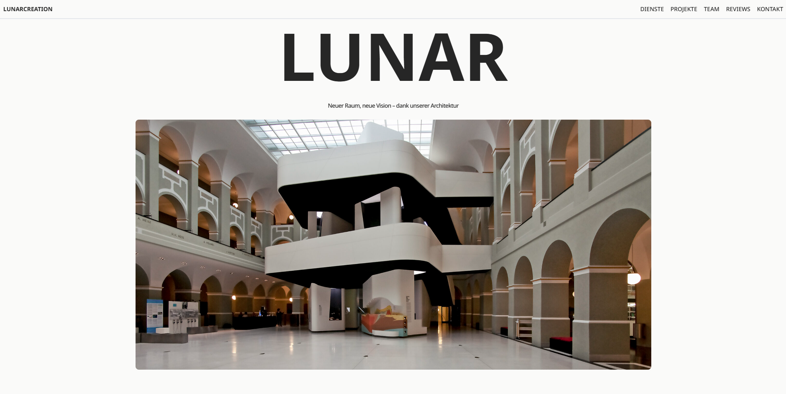
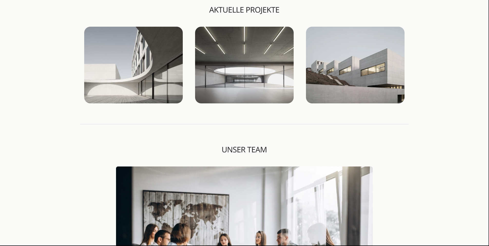
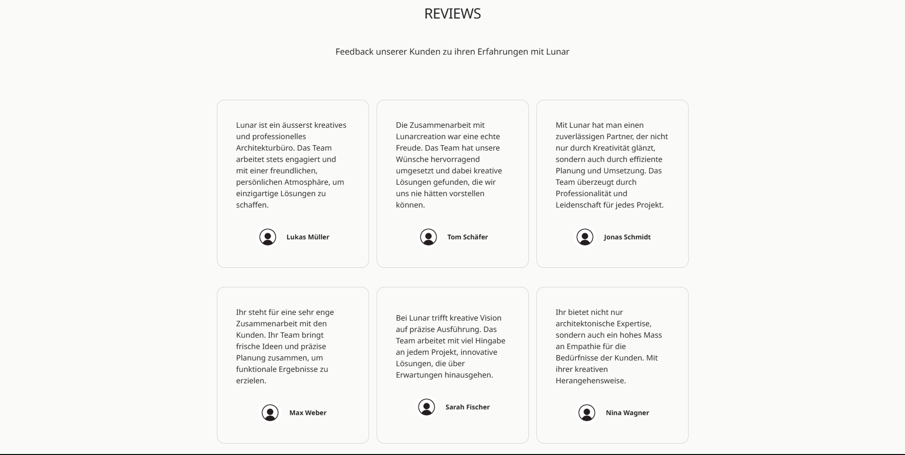
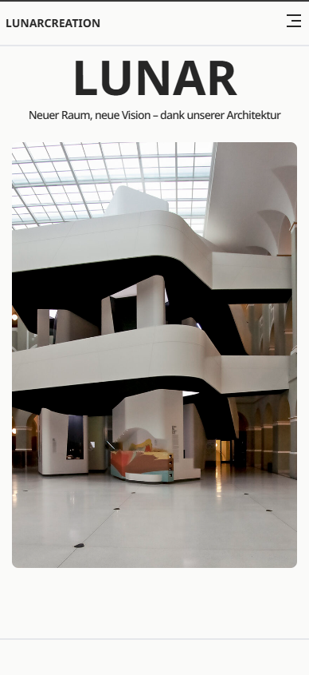
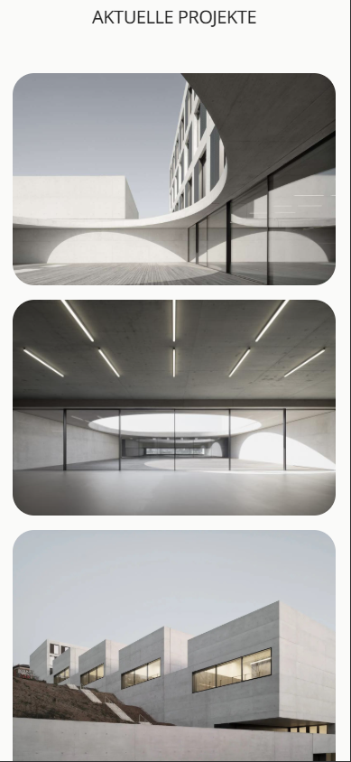
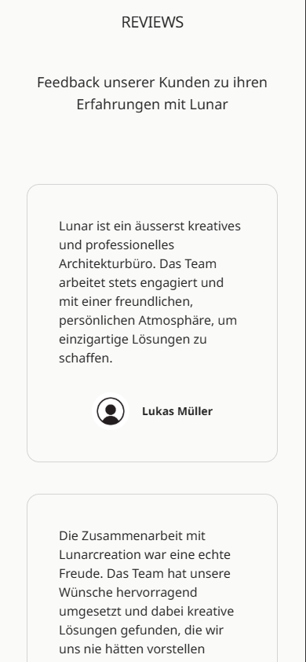

# Architecture Office Website for lunarcreation (responsive)

This is a hypothetical website for an architecture office, created using **HTML/ CSS**, **Tailwind CSS**, **JavaScript**, **React**, and **Vite**. It is my first project using this Stacks (React & Tailwind CSS) so I had to follow a guide to build it as a learning exercise.

## Preview

### Desktop 
             

### Mobile 
            

## Demo

### Desktop
https://github.com/user-attachments/assets/b663986c-4839-4b09-af12-ce85f099c3ef

### Mobile 
https://github.com/user-attachments/assets/f66d03ea-655d-4dfa-9e84-db33439f691e

## Status

The website is currently a completed concept. It was created as a practice project to learn how to built a website with React and Tailwind CSS.

## Features

- Modern, responsive design for Mobile and Desktop
- Built with React for interactive and dynamic content
- Styled with Tailwind CSS for a clean and consistent design

## Technologies

- HTML/ CSS
- JavaScript
- React
- Tailwind CSS
- Vite

## Installation

1. Clone the repository:

   ```bash
   git clone https://github.com/venu21-dev/ArchitectureOffice_Website.git
